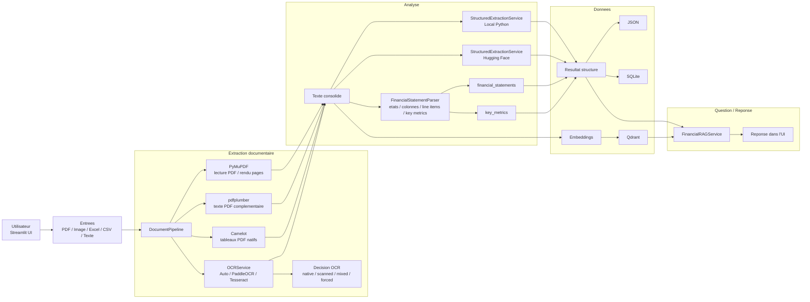
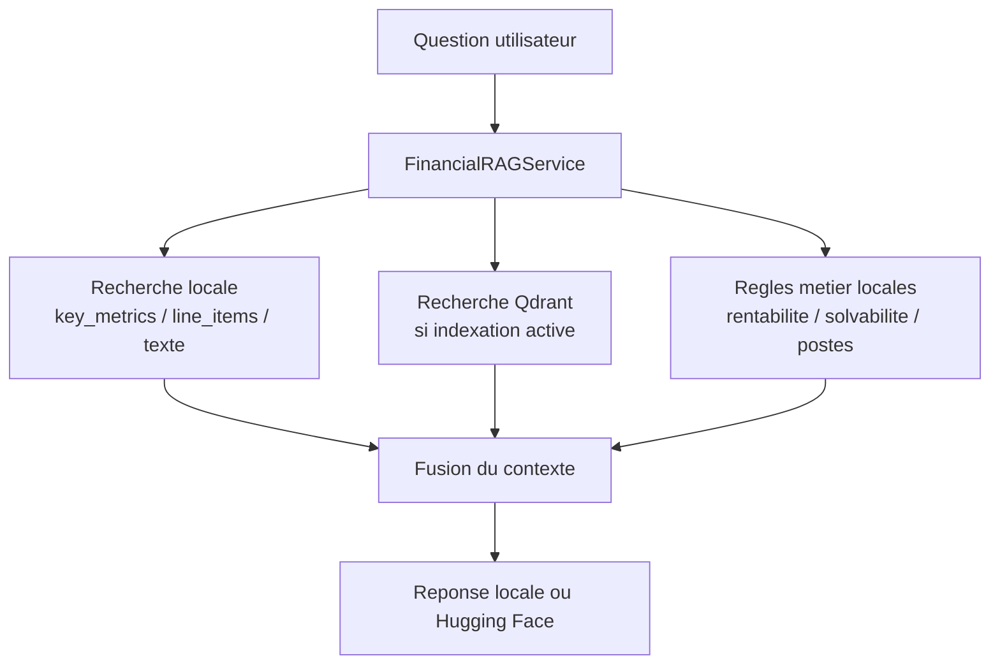

# Solution FS

Application Streamlit pour extraire, structurer, indexer et interroger des etats financiers a partir de PDF, images, Excel, CSV ou texte brut.

## Vue d'ensemble

Fonctions principales :
- extraction de texte native pour les PDF accessibles
- OCR avec decision automatique ou moteur force
- extraction tabulaire avec Camelot pour les PDF natifs
- structuration locale ou enrichie via Hugging Face
- extraction financiere specialisee par etat et par periode
- stockage JSON et SQLite
- indexation Qdrant
- chat RAG sur le document traite

## Architecture



## Flux du chat



## Composants et utilite exacte

### Streamlit

Role :
- interface utilisateur
- upload de fichiers
- choix des options de traitement
- affichage du texte, du JSON, des tableaux financiers et du chat

### PyMuPDF

Role :
- lecture native des PDF
- extraction du texte page par page
- rendu d'images de pages pour l'OCR

Usage :
- PDF natifs
- preparation des pages PDF pour PaddleOCR ou Tesseract

### pdfplumber

Role :
- extraction texte complementaire pour certains PDF

Usage :
- secours si la lecture native seule est inegale

### Camelot

Role :
- extraction de tableaux dans les PDF natifs

Usage :
- bilans
- etats des resultats
- colonnes comparatives du type `2025 / 2024` ou `Prevu 2025 / 2025 / 2024`

Important :
- Camelot ne fait pas d'OCR
- il est utile seulement si le PDF contient deja du vrai texte

### Tesseract

Role :
- OCR classique

Usage :
- scans
- images
- fallback si PaddleOCR echoue

### PaddleOCR

Role :
- OCR deep learning plus robuste

Usage :
- documents scannes difficiles
- PDF image
- image de document

Etat actuel :
- stabilise dans Docker
- utilise des modeles `mobile` plus legers
- bascule automatiquement sur Tesseract si PaddleOCR renvoie un resultat vide ou echoue

### Hugging Face

Role :
- enrichissement semantique optionnel
- reformulation de reponses dans le chat

Usage :
- mode `Enrichi (Hugging Face)`
- generation de reponses RAG quand un token est disponible

### FinancialStatementParser

Role :
- detection des etats financiers
- detection dynamique des colonnes d'annees
- extraction des line items
- derivation des `key_metrics`

Sorties principales :
- `financial_statements`
- `key_metrics`

### Qdrant

Role :
- indexation vectorielle
- recherche semantique pour le chat

Usage :
- optionnel
- utile surtout pour le chat et la recherche documentaire

### SQLite et JSON

Role :
- persistance locale des resultats

Usage :
- historique
- debug
- export

## Choix automatique de l'OCR

Le pipeline commence toujours par l'extraction native.

Ensuite, `DocumentPipeline._should_run_ocr()` decide si l'OCR est necessaire.

Signaux utilises :
- texte natif vide
- texte trop court par page
- texte trop bruite
- structure de lignes trop fragmentees
- image en entree
- OCR force par l'utilisateur

Sortie de la decision :
- `should_run`
- `pdf_type`
- `reason`
- `details`

Exemples de raisons :
- `native_text_empty`
- `native_text_too_short`
- `native_text_too_noisy`
- `line_structure_too_fragmented`
- `forced_by_user`
- `engine_selected_by_user`

## Modes disponibles dans l'UI

### Moteur OCR

Valeurs :
- `Auto`
- `PaddleOCR`
- `Tesseract`

Comportement :
- `Auto` : utilise l'extraction native d'abord puis declenche l'OCR seulement si necessaire
- `PaddleOCR` : force le passage OCR Paddle
- `Tesseract` : force le passage OCR Tesseract

### Mode d'analyse

Valeurs :
- `Rapide (Local)`
- `Enrichi (Hugging Face)`

Comportement :
- `Rapide (Local)` : structuration locale deterministe
- `Enrichi (Hugging Face)` : enrichissement semantique en plus

### Forcer OCR

Valeurs :
- `true`
- `false`

Comportement :
- active l'OCR meme si le PDF contient deja du texte natif

### Indexer dans Qdrant

Valeurs :
- `true`
- `false`

Comportement :
- cree des embeddings
- envoie les chunks dans Qdrant
- rend le chat plus utile pour la recherche semantique

## Chat actuel

Le chat actuel est un service RAG hybride, pas encore un agent autonome.

Il combine :
- regles locales pour certaines questions financieres
- recherche dans `key_metrics`
- recherche dans `financial_statements`
- recherche dans le texte extrait
- Qdrant si l'indexation est active
- Hugging Face si disponible

Il est bon pour :
- valeurs simples
- comparaison de periodes
- questions de rentabilite ou solvabilite

Il reste limite pour :
- questions de sous-sections complexes
- enumerations longues
- navigation fine dans la structure d'un etat

## Variables d'environnement

Variables lues dans [config.py](/C:/Users/cherq/Documents/Playground%204/src/document_platform/config.py) :

### `APP_DATA_DIR`

Defaut :
- `data`

Role :
- dossier local des donnees applicatives

### `HF_TOKEN`

Role :
- token Hugging Face pour l'enrichissement et certains appels de chat

### `HF_BASE_URL`

Defaut :
- `https://router.huggingface.co`

### `HF_MODEL`

Defaut :
- `katanemo/Arch-Router-1.5B:hf-inference`

### `HF_EMBED_MODEL`

Defaut :
- `intfloat/multilingual-e5-large`

### `QDRANT_URL`

Defaut :
- `http://qdrant:6333`

### `QDRANT_COLLECTION`

Defaut :
- `documents`

Note :
- le nom reel de collection peut etre versionne automatiquement selon le modele d'embedding et sa dimension

### `TESSERACT_CMD`

Role :
- chemin explicite vers l'executable Tesseract si besoin

### `OCR_ENGINE`

Valeurs :
- `auto`
- `paddleocr`
- `tesseract`

### `PADDLE_PDX_DISABLE_MODEL_SOURCE_CHECK`

Defaut :
- `True`

Role :
- evite certains checks reseau Paddle au demarrage

### `FLAGS_use_mkldnn`

Defaut :
- `0`

Role :
- limite certains problemes runtime Paddle CPU

### `PADDLE_PDX_LOCAL_FONT_FILE_PATH`

Defaut :
- `/usr/share/fonts/truetype/dejavu/DejaVuSans.ttf`

Role :
- evite a Paddle de telecharger des polices a chaud

## Fichiers principaux

### [app.py](/C:/Users/cherq/Documents/Playground%204/app.py)

UI Streamlit, options, onglets et affichage des resultats.

### [pipeline.py](/C:/Users/cherq/Documents/Playground%204/src/document_platform/pipeline.py)

Orchestration complete du traitement documentaire.

### [ocr.py](/C:/Users/cherq/Documents/Playground%204/src/document_platform/services/ocr.py)

Gestion des moteurs OCR et fallback Paddle -> Tesseract.

### [financial_parser.py](/C:/Users/cherq/Documents/Playground%204/src/document_platform/services/financial_parser.py)

Extraction structuree des etats financiers et des metriques.

### [structured_extraction.py](/C:/Users/cherq/Documents/Playground%204/src/document_platform/services/structured_extraction.py)

Structuration generale du document.

### [rag_chat.py](/C:/Users/cherq/Documents/Playground%204/src/document_platform/services/rag_chat.py)

Chat RAG actuel base sur contexte structure + texte + Qdrant.

### [indexing.py](/C:/Users/cherq/Documents/Playground%204/src/document_platform/services/indexing.py)

Embeddings, indexation et recherche dans Qdrant.

## Lancement local

```powershell
python -m venv .venv
.venv\Scripts\Activate.ps1
pip install -r requirements.txt
streamlit run app.py
```

## Lancement Docker

```powershell
docker compose up -d --build
```

## Endpoints

- Streamlit: [http://localhost:8501](http://localhost:8501)
- Qdrant: [http://localhost:6333](http://localhost:6333)

## Exemple `.env`

Le modele de reference est [.env.example](/C:/Users/cherq/Documents/Playground%204/.env.example).

```env
HF_TOKEN=
HF_BASE_URL=https://router.huggingface.co
HF_MODEL=katanemo/Arch-Router-1.5B:hf-inference
HF_EMBED_MODEL=intfloat/multilingual-e5-large
QDRANT_URL=http://qdrant:6333
QDRANT_COLLECTION=documents
APP_DATA_DIR=/app/data
TESSERACT_CMD=
OCR_ENGINE=auto
PADDLE_PDX_DISABLE_MODEL_SOURCE_CHECK=True
FLAGS_use_mkldnn=0
PADDLE_PDX_LOCAL_FONT_FILE_PATH=/usr/share/fonts/truetype/dejavu/DejaVuSans.ttf
```

## Recommandations pratiques

- utiliser `Rapide (Local)` par defaut
- utiliser `PaddleOCR` pour les scans difficiles
- utiliser `Tesseract` si tu veux une option OCR plus simple et previsible
- laisser `Camelot` faire le travail pour les PDF natifs avec tableaux
- activer `Indexer dans Qdrant` surtout si le chat doit servir ensuite
- considerer le chat actuel comme un bon assistant RAG, mais pas encore comme un agent autonome
