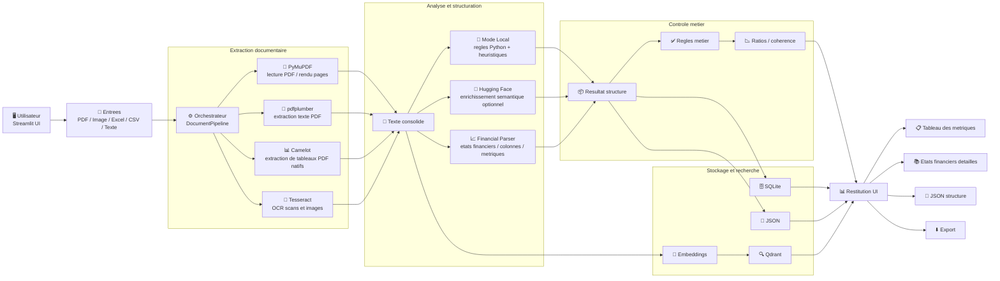

# Solution FS

Application Streamlit de traitement documentaire et d'extraction financiere.

Elle permet de charger des documents `PDF`, `images`, `Excel`, `CSV` ou du `texte`, puis de:
- extraire le texte
- reconstruire les tableaux financiers
- detecter les periodes et les colonnes comparatives
- produire un JSON structure
- stocker les resultats en `JSON` et `SQLite`
- indexer le contenu dans `Qdrant` si active

## Diagramme d'architecture



## Vue d'ensemble

Pipeline reel de l'application:

1. `Streamlit UI` recoit un fichier ou du texte
2. `DocumentPipeline` orchestre le traitement
3. extraction native du contenu
4. OCR `Tesseract` si necessaire
5. extraction structuree:
   - mode `Rapide (Local)`
   - ou mode `Enrichi (Hugging Face)`
6. extraction financiere specialisee:
   - etats financiers
   - periodes
   - line items
   - key metrics
7. regles metier
8. stockage `JSON` / `SQLite`
9. indexation `Qdrant` optionnelle

## Outils utilises

### Streamlit

Role:
- interface utilisateur
- upload des fichiers
- choix des options de traitement
- affichage du texte extrait
- affichage du JSON structure
- affichage des tableaux financiers

Quand il intervient:
- au debut pour l'entree utilisateur
- a la fin pour la restitution

Configuration visible dans l'UI:
- `Forcer OCR`
- `Mode d'analyse`
- `Indexer dans Qdrant`

### PyMuPDF

Role:
- lecture native des PDFs
- extraction du texte page par page
- rendu image des pages pour OCR si besoin

Quand il intervient:
- pour les PDFs texte
- pour les PDFs scannes avant OCR

Cas d'usage:
- recuperer rapidement le texte d'un PDF accessible
- servir de base au parseur financier

### pdfplumber

Role:
- extraction texte complementaire depuis PDF
- utile pour certains PDFs ou la mise en page est moins bien lue par d'autres outils

Quand il intervient:
- dans la couche d'extraction documentaire PDF

Cas d'usage:
- PDF texte classique
- fallback si la lecture native est imparfaite

### Camelot

Role:
- extraction de tableaux dans les PDFs natifs
- reconstruction des colonnes et des cellules

Quand il intervient:
- avant les heuristiques locales sur les PDFs accessibles
- surtout pour les etats financiers avec colonnes comparatives

Cas d'usage:
- tableaux `2025 / 2024`
- tableaux `Prevu 2025 / 2025 / 2024`
- bilans, etats des resultats, flux de tresorerie

Important:
- `Camelot` ne fait pas d'OCR
- il fonctionne mieux sur les PDFs qui contiennent deja du vrai texte et de vraies lignes de tableau

### Tesseract

Role:
- OCR
- lecture du texte a partir d'une image ou d'un PDF scanne

Quand il intervient:
- si `Forcer OCR` est active
- ou si l'extraction native retourne peu ou pas de texte

Cas d'usage:
- PDF scanne
- image `png/jpg/jpeg`
- document photo

Important:
- `Tesseract` lit le texte, mais ne reconstruit pas aussi bien les tableaux que `Camelot`
- il est utile quand le document n'est pas nativement exploitable

### Hugging Face

Role:
- enrichissement semantique optionnel
- aide a produire une structure plus interpretee

Quand il intervient:
- seulement en mode `Enrichi (Hugging Face)`

Cas d'usage:
- documents heterogenes
- libelles tres variables
- besoin d'un resume ou d'une structure plus souple

Important:
- ce mode depend d'un token `HF_TOKEN`
- sans token, l'application repasse en fallback local

### Qdrant

Role:
- indexation vectorielle
- recherche semantique future

Quand il intervient:
- seulement si `Indexer dans Qdrant` est active

Cas d'usage:
- retrouver des documents similaires
- preparer une recherche sémantique
- alimenter un futur moteur de question/reponse

### SQLite

Role:
- stockage local structure des resultats

Quand il intervient:
- a chaque execution du pipeline

Cas d'usage:
- conserver un historique local
- reconsulter les resultats

### JSON

Role:
- sortie exploitable et portable

Quand il intervient:
- a chaque traitement

Cas d'usage:
- integration avec d'autres outils
- export des resultats
- verification manuelle

## Comment le choix des outils se fait

### PDF natif avec tableaux

Ordre prefere:
1. `PyMuPDF` / extraction native
2. `Camelot` pour les tableaux
3. fallback heuristique local si besoin

### PDF scanne ou image

Ordre prefere:
1. `Tesseract`
2. heuristiques locales
3. `Hugging Face` si le mode enrichi est active

### Excel / CSV

Ordre prefere:
1. lecture native
2. structuration locale
3. enrichissement semantique eventuel

## Modes disponibles dans l'UI

### Rapide (Local)

Ce mode utilise:
- extraction native
- OCR si necessaire
- regles Python locales
- parseur financier local

Avantages:
- plus stable
- plus rapide
- pas de dependance cloud

A utiliser si:
- tu veux un resultat fiable et reproductible
- le document est deja assez lisible

### Enrichi (Hugging Face)

Ce mode ajoute:
- appel au modele Hugging Face pour enrichir la structure generale

Avantages:
- meilleur sur les libelles flous
- plus souple sur les documents heterogenes

Limites:
- depend du reseau
- depend d'un token
- moins deterministe que le mode local

## Configuration de l'interface

### Forcer OCR

Valeurs:
- `false`
- `true`

Effet:
- force l'utilisation de `Tesseract` meme si le PDF contient deja du texte

A utiliser si:
- le texte extrait est vide
- le PDF natif est de mauvaise qualite
- les tableaux sont mal lus nativement

### Mode d'analyse

Valeurs:
- `Rapide (Local)`
- `Enrichi (Hugging Face)`

Effet:
- choisit la couche de structuration generale du document

### Indexer dans Qdrant

Valeurs:
- `false`
- `true`

Effet:
- active ou non la creation d'embeddings et l'indexation vectorielle

## Configuration par variables d'environnement

Variables supportees dans [config.py](/C:/Users/cherq/Documents/Playground%204/src/document_platform/config.py):

### `APP_DATA_DIR`

Defaut:
- `data`

Role:
- dossier de stockage local

Contient:
- fichiers JSON
- base SQLite

### `HF_TOKEN`

Defaut:
- non defini

Role:
- token d'acces a Hugging Face

Necessaire pour:
- le mode `Enrichi (Hugging Face)`
- les embeddings Hugging Face

Si absent:
- l'application reste utilisable
- elle bascule sur le mode local/fallback

### `HF_BASE_URL`

Defaut:
- `https://router.huggingface.co`

Role:
- URL de base des appels Hugging Face

### `HF_MODEL`

Defaut:
- `katanemo/Arch-Router-1.5B:hf-inference`

Role:
- modele utilise pour la structuration semantique

### `HF_EMBED_MODEL`

Defaut:
- `intfloat/multilingual-e5-large`

Role:
- modele utilise pour les embeddings

### `QDRANT_URL`

Defaut:
- `http://localhost:6333`

Role:
- URL du serveur Qdrant

### `QDRANT_COLLECTION`

Defaut:
- `documents`

Role:
- nom de la collection Qdrant

### `TESSERACT_CMD`

Defaut:
- vide

Role:
- chemin explicite vers l'executable Tesseract

Utile si:
- Tesseract n'est pas trouve automatiquement
- installation Windows personnalisee

## Fichiers principaux du projet

### [app.py](/C:/Users/cherq/Documents/Playground%204/app.py)

Contient:
- l'interface Streamlit
- les options utilisateur
- l'affichage des resultats

### [pipeline.py](/C:/Users/cherq/Documents/Playground%204/src/document_platform/pipeline.py)

Contient:
- l'orchestration complete du traitement

### [financial_parser.py](/C:/Users/cherq/Documents/Playground%204/src/document_platform/services/financial_parser.py)

Contient:
- la detection des etats financiers
- la detection des colonnes
- l'utilisation de `Camelot`
- la reconstruction des line items
- les `key_metrics`

### [structured_extraction.py](/C:/Users/cherq/Documents/Playground%204/src/document_platform/services/structured_extraction.py)

Contient:
- la structuration generale du document
- le mode local
- le mode Hugging Face

### [indexing.py](/C:/Users/cherq/Documents/Playground%204/src/document_platform/services/indexing.py)

Contient:
- les embeddings
- l'envoi vers Qdrant

### [storage.py](/C:/Users/cherq/Documents/Playground%204/src/document_platform/services/storage.py)

Contient:
- le stockage JSON
- le stockage SQLite

## Demarrage local

```powershell
python -m venv .venv
.venv\Scripts\Activate.ps1
pip install -r requirements.txt
streamlit run app.py
```

## Demarrage avec Docker

```powershell
docker compose up -d --build
```

## Endpoints

- Streamlit: [http://localhost:8501](http://localhost:8501)
- Qdrant: [http://localhost:6333](http://localhost:6333)

## Exemple de configuration `.env`

Le fichier versionnable de reference est [.env.example](/C:/Users/cherq/Documents/Playground%204/.env.example).

Exemple:

```env
HF_TOKEN=
HF_BASE_URL=https://router.huggingface.co
HF_MODEL=katanemo/Arch-Router-1.5B:hf-inference
HF_EMBED_MODEL=intfloat/multilingual-e5-large
QDRANT_URL=http://qdrant:6333
QDRANT_COLLECTION=documents
APP_DATA_DIR=/app/data
TESSERACT_CMD=
```

## Recommandations pratiques

- utilise `Rapide (Local)` par defaut
- active `Forcer OCR` pour les scans
- laisse `Camelot` faire le travail sur les PDFs natifs avec tableaux
- active `Enrichi (Hugging Face)` seulement si tu as besoin d'un enrichissement semantique
- desactive `Indexer dans Qdrant` si tu veux juste extraire sans indexer
